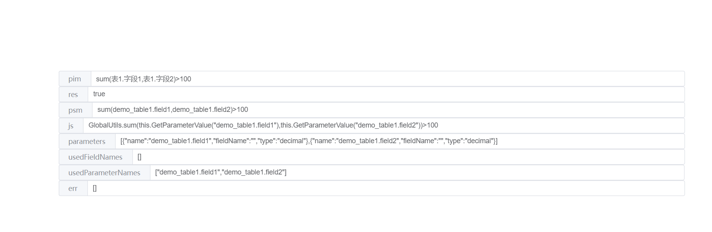

# 前端 表达式解析引擎

平台使用的一个表达式解析引擎，用来分析使用的参数与函数转换。

低代码平台中表达式引擎的一个功能，在 MDA 中从 PIM 转 PSM 转 Code 中起到重要作用。

前端领域应该是有些 AST 解析构建工具，本项目 1000 行代码应该能体现 AST 是怎么做单词拆分与词法语义分析的，简单不简约。

有兴趣的可以看看，希望对理解表达式引擎，转换 AST 等相关的知识点提供点帮助

效果图

pim 为语义化的操作表达式

psm 为后端表达式引擎最终执行的表达式

js 为前端执行的表达式（可直接 new Function 后执行获取值）

params 为表达式执行需要使用的参数
